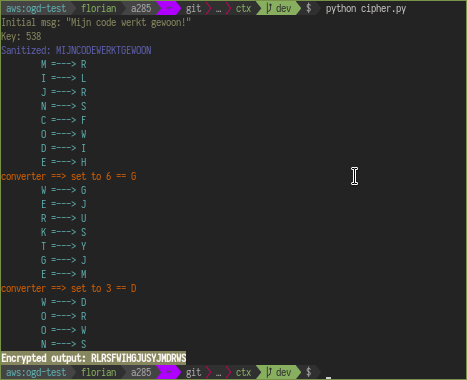

# CTx
> Caesar Cipher with a Twist.
> - Florian, 2021



## tl;dr
Based on the existing Caesar Cipher, we have a set code where we skip steps in the alphabet to encrypt a message or text. In [Example 1](#no-rotation) we only have the code initial code `538(x)`. In [Example 3](#one-rotation) we use **2** code rotation(s), which uses the initial cipher _(538(x))_, which gets rotated every time based on the `x` value of the initial code.

For this simple (initial) example of encryption we are gonna use a simple calculation (unlike the [Enigma machine](todo)) where we just divide the input by 2, to create a new value for the rotation (rotor) _(* This will be improved in the future)_.

## Testing
Just run the following for testing the code.

```bash
  $ python cipher.py
```

## Encryption

##### Simple initial encyption example explained
```bash
    ## One rotation (x==1)
    # initial rotor code: 538(1)
    # calculation: ($input/2)
    538
      > (5/2 = 2.5 == 3)
      > (3/2 = 1.5 == 2)
      > (8/2 = 4.0 == 4)
    ==> 324

    # New rotor code:
    > 324

    # * (float value gets rounded up)
```

### Encryption Examples

##### No rotation

|code|input|output|
|-|-|-|
|5380|ik kan niet slapen|NNSFQUNHBYOIUQ|

##### One Rotation

|code|input|output|
|-|-|-|
|5381|ik kan niet slapen|NNSFQUNHBYOIUQ|
|324|NNSFQUNHBYOIUQ|QPWISYQJFBQMXS|

##### Two Rotations

|code|input|output|
|-|-|-|
|5382|ik kan niet slapen|NNSFQUNHBYOIUQ|
|324|NNSFQUNHBYOIUQ|QPWISYQJFBQMXS|
|212|QPWISYQJFBQMXS|SQYKTASKHDROZT|
```bash
  # initial
  538(2)
  >= 538

  # rotation (x-1)
  > (5/2 = 2.5 == 3)
  > (3/2 = 1.5 == 2)
  > (8/2 = 4.0 == 4)
  >= 324

  # rotation (x-1)
  > (3/2 = 1.5 == 2)
  > (2/2 = 1.0 == 1)
  > (4/2 = 2.0 == 2)
  >= 212
```

## Decryption
This is easy peazy, when you have the `initial key`. Same with the rotation steps, you can re-create the codes with the `init`.

zodus
